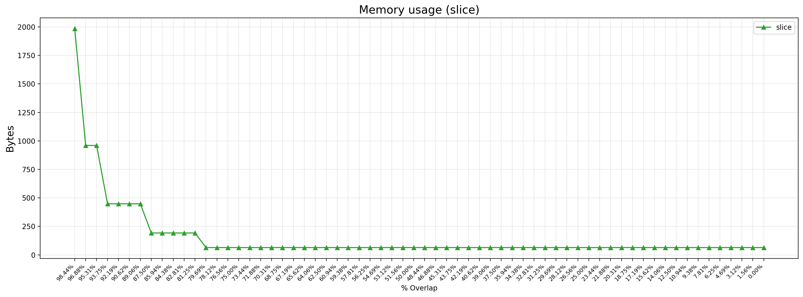
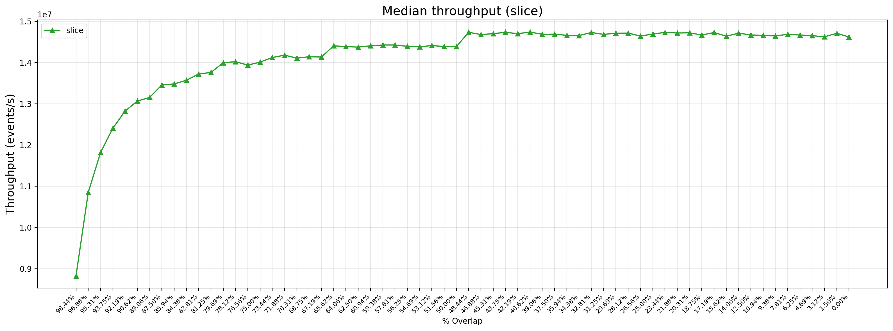
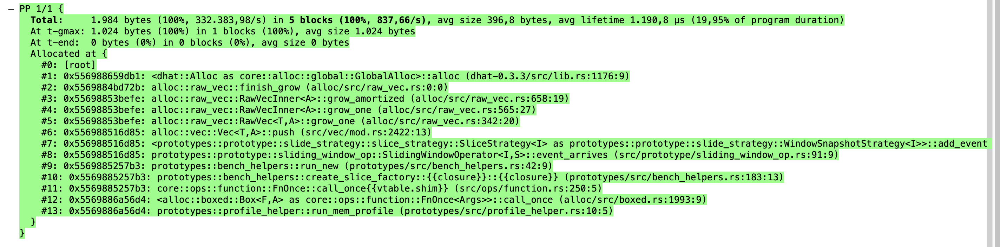
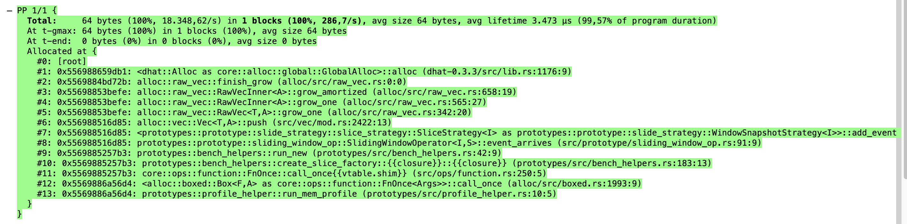
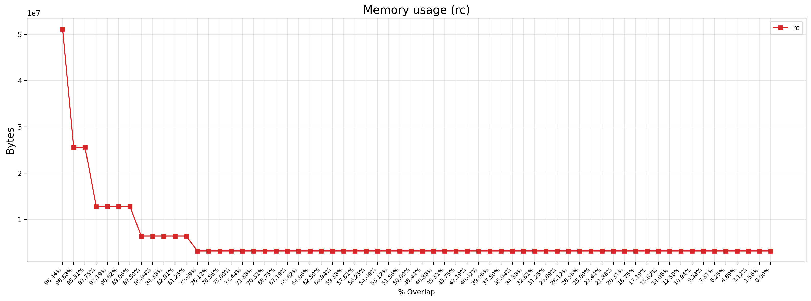
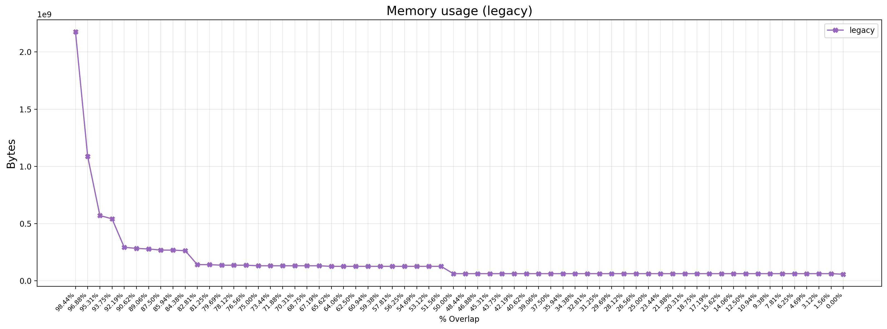

You can see a clear pattern here that with high overlap, the memory usage is much higher. Which is unexpected. You'd expect memory usage to be zero everywhere. From a previous graph, we also know its not from the window closed (reporting) but originating from elsewhere.

However, it does impact performance, so it should be accounted for:

---
This figures shows the memory usage for the workload with the highest % overlap. This is much higher than the one below.

---
This figure shows the memory usage for the workload with the lowest % overlap. This is much lower than the one with the highest % overlap.

---

It seems to be that the add_event is responsible for this, more specifically, the growing of the vector. Since that is just plain Rust, and the internal mechanics do not differ. As well as from the observation that the extra memory usage only happens between some specific slide configurations, that this has to do with some thresholding or condition for how growth happens.

---

As you can see it all happens at 'almost' the same % of overlap which is weird. Even the legacy one. Even though Legacy has a different implementation.

---