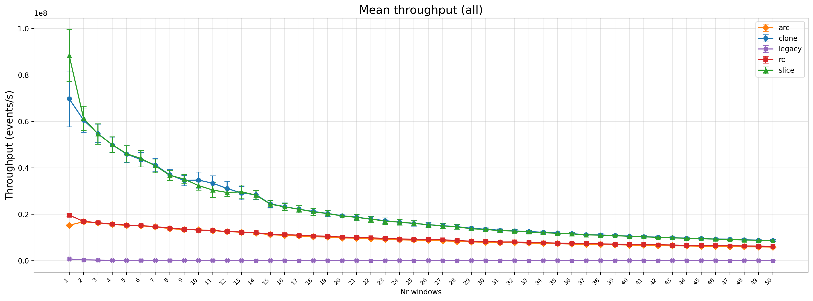
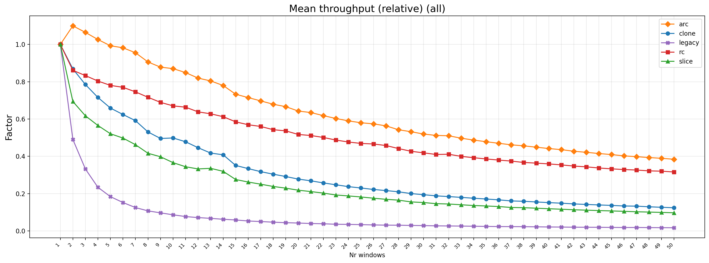

I have experimented with the parameter 'nr_windows'. For simplicity I made the windows simply stack and be of the same size. This allows to simply report on the same windows for each window. In real settings you would I think always use windows of different configurations (or not? Maybe different queries defined within each window?), but for testing purposes I think this is the most feasible (given time constraints) and relevant.
 
Windows range from 1..=50
 
The main thing I wanted to show here is that because in the new S2R architecture, windows are simply defined by simple structs that hold open and closing time bounds (indices), you only need to add the events to a single 'stream source'. What makes it slower as nr_windows increases (in my architecture) is that you have to check more windows for 'whether they slide' when an event arrives.
 
The clone and slice strategy descent more rapidly than the rc and arc strategy. My reasoning here is that arc and rc always have this extra bit of overhead because of the increments and decrements that happen. So they already have lower throughput to start with, and then the extra 'overhead' introduced from extra windows is simply a smaller proportion.
 
As always, LegacyWindow has the lowest throughput.

---

The graph above shows relative throughput decrease compared to the first point (compared to nr_windows = 1). The main thing I wanted to show here is that for the LegacyWindow, you need to create a new instance of that window (which itself holds the stream items), which means that for twice the number of windows, you get half the throughput. You can see that for the other strategies, that is not the case, because you they all 'select' from the same stream and you only have extra SlidingWindowBounds structs inside that same S2R operator.

---

# Extra things to test

- Consider extra overhead per event (increase the number of bytes per event for example). This should eventually lead to almost 'no impact' of extra windows because the overhead of adding events is significant compared to 'checking whether the windows slide'

- Make the window report many times (generate more reports) compare graphs when you have more reports (or more reports per event). Exclude the legacy strategy for this.