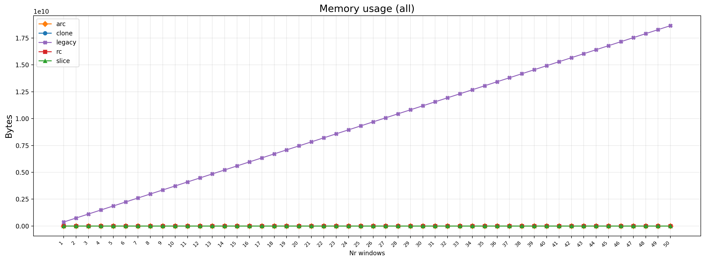
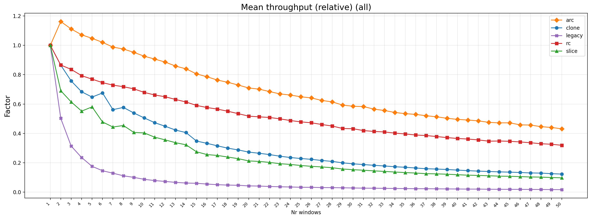
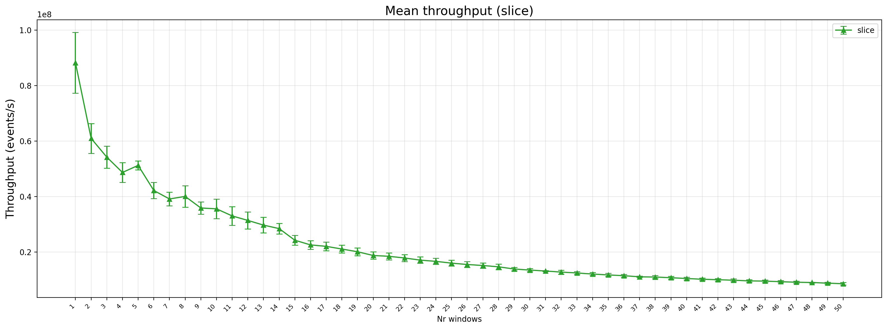

Command used to run:

`--name vary_windows_non_reporting_events --sample-size 30 --workloads --nr-windows 1..=50 --nr-events 5000 --size 5000 --slide 5000 --event-spread 1 --event-offset 1 --bytes 0 --reserve 5000`

- Why reserve bytes: to not make the allocations count here when you add new windows. Maybe good to experiment with a different number of bytes.

You can see here that the number of bytes here increase proportionally. My assumption is that a new vector has to be allocated here. But to be fair, the vector also needs to be created initially in the new S2R architecture.
- This might be a bug: make sure to call scope() once to pre-create this vector (always, because with or without reserve, the other strategy also creates this initial one)

You can see here that the legacy window gets worse performance faster when you increase the number of windows. But that might still be because of the initial scope that gets called for each window. So I will exclude that and see what results I will get

This one declines a bit more slowly. You can observe however that the standard deviation is much higher when number of windows is set to 1. Also you see a small 'jump' at nr_windows = 1. Standard deviation is low however, but I still think this might b e some kind of OS jitter. It gets more stable towards the end when nr of windows is higher.

But that might also just be because when throughput is higher, variability gets much higher as well, and vice versa. So I could try to see how nr_windows = 1 with exact same configuration gives in variability in tersm of throughput here.
